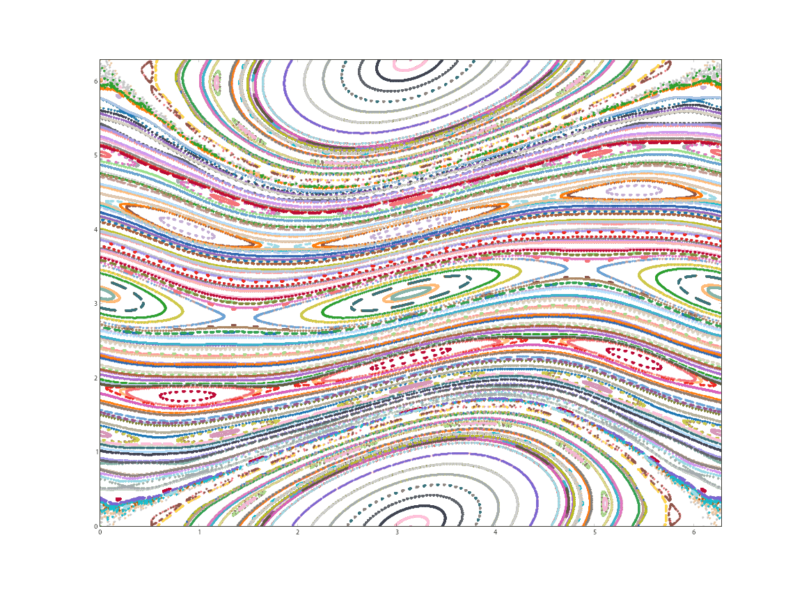
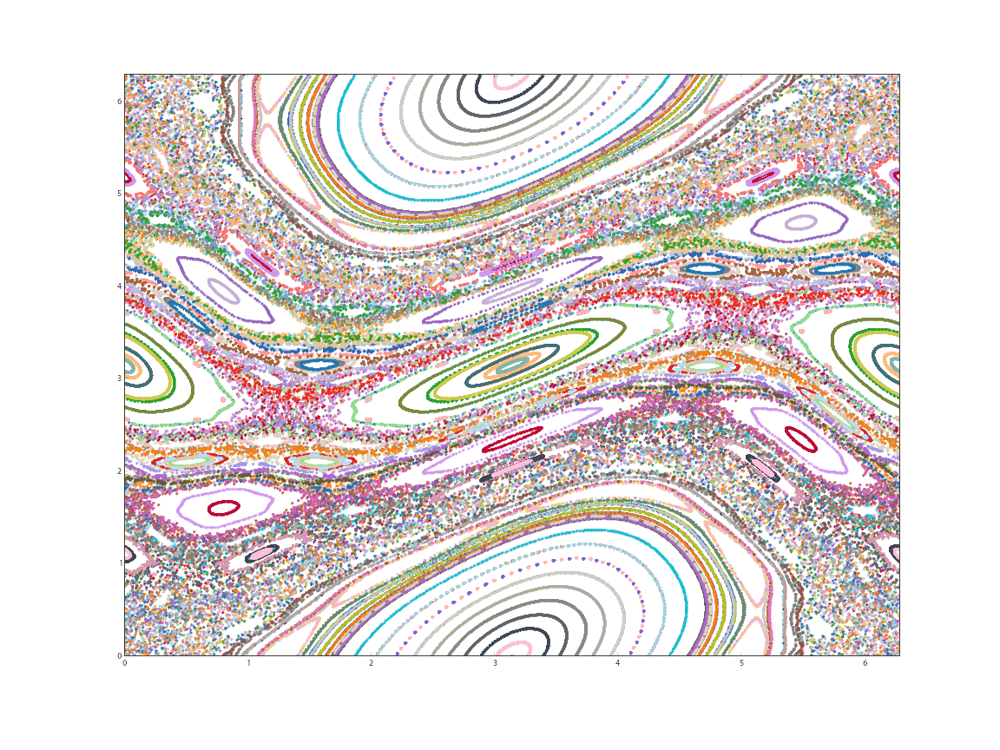

# Description

This script simulates the action of the Chirikov standard map on an evenly-spaced grid of initial points in phase space and generates corresponding phase plots illustrating the different behaviors, such as limit cycles and chaos, emerging from various locations for different values of hte "kicking" parameter K

# Example output

